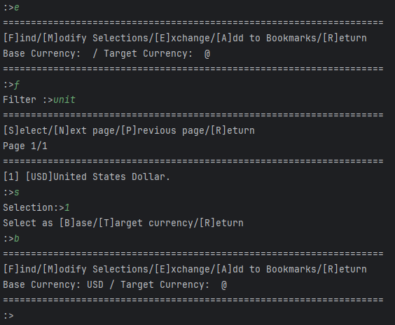

# Alura Currency Exchange 


Simple java console app for currency exchange.

This project is part of the Alura One Next Education program.

## Dependencies

This project uses 2 external libraries, Google gson and Dotenv.

## Installation

In order to run this application you should follow this steps

1. Clone the source code:

```sh
git clone https://github.com/jmortegaf/alura-challenge2.git
```

2. cd into the project folder:

```sh
cd alura-challenge2
```

3. compile the project:

```sh
javac -d out -cp "modules/*" .\src\main\Main.java .\src\api\request\*.java .\src\menus\*.java .\src\models\*.java
```

4. cd into the out folder:

```
cd out
```

5. run the program:

```
java -cp ".;..;../modules/*"  main.Main
```

## Usage

### Main Menu
Once you run the program you're presented with the main menu


### Bookmark Menu
The bookmarks menu show every conversion bookmark saved by the user,
from there you can make an exchange directly by pressing e


### Exchange Menu
In the exchange menu you can find a currency by entering f and then
searching a currency, for example if you enter unit, it returns all
currencies that contain the string unit, in this case United States Dollar,
then you select the currency by its index, and finally select it as base or 
target currency.



Then you do the same process for the target currency.


Finally, you make the exchange and input the amount


### History Menu
The history menu shows all the previous exchanges made by the user.


 

